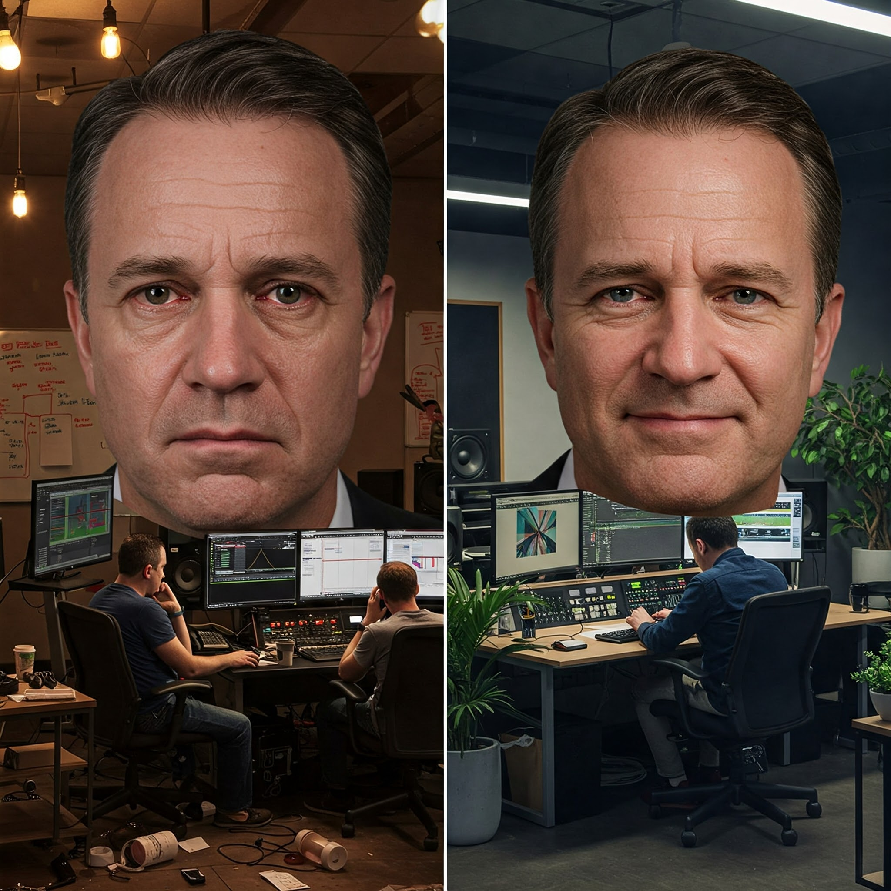

I'll never forget walking into a once-promising VFX studio to find sleep-deprived artists hunched over outdated workstations, rendering times stretching into days instead of hours. The owner—bleary-eyed and stressed—confided that a major client payment was three weeks late. Meanwhile, they couldn't afford to upgrade their render farm despite having just landed their biggest project ever.

This wasn't just bad luck. It was a structural failure that plagues countless digital post-production studios.

==At the heart of most struggling VFX studios lies a fundamental misunderstanding: treating infrastructure investments as project expenses rather than capital investments.== This conflation isn't just an accounting technicality—it's slowly killing studios and burning out artists.

# The Project-to-Project Prisoner's Dilemma

Most small to mid-sized VFX studios operate like hamsters on a cash-flow wheel—constantly running but never advancing. They fund everything—from artist salaries to software licenses to critical hardware upgrades—directly from project budgets. This creates a precarious situation where a single delayed payment can cascade into operational paralysis.

"We'll upgrade when the next big project comes in," becomes the eternal promise. But when that project arrives, its budget gets consumed by immediate operational needs, creating a vicious cycle.

Think of it like trying to renovate your house while you're still paying off the mortgage with your weekly paycheck. You might replace a window here or fix a door there, but you'll never truly transform the foundation.

I've worked with studios on both sides of this divide. The ones struggling were invariably those treating their pipeline and infrastructure as "nice to have" expenses rather than competitive necessities. The thriving studios? They had separate budget tracks that insulated core infrastructure from project volatility.

# The Hidden Cost of Technical Debt

When I joined one particular VFX house as a freelancer, I was astonished to find artists manually compiling delivery packages, painstakingly ensuring files met the naming conventions and folder structures required by clients. What should have been a simple automated process was consuming senior artists' time—expensive talent essentially performing data entry.

This is technical debt in action. And it compounds with interest.

Let me ask you something uncomfortable: How much is your studio's inability to upgrade costing you in actual dollars? Have you calculated the lost productivity from outdated workstations? The opportunity cost of projects you can't bid on because your infrastructure can't support them?

Most studios haven't run this analysis. They feel pipeline automation and infrastructure upgrades are expenses rather than investments with quantifiable returns.

Here's a simple thought experiment: If each team member loses just 10% of their productive time to workflow inefficiencies or technical limitations, how much does that cost your studio monthly? For a 20-person team with an average cost of $60k per year per person, that's $10,000 in lost productivity every month.

# Breaking the Cycle: Strategic Financial Architecture

The solution isn't necessarily more money—it's smarter money management.

The thriving studios I've encountered share a common trait: they maintain separate budget tracks. They allocate a fixed percentage of each project budget (typically 10-15%) to a dedicated studio development fund. This isn't just accounting sleight-of-hand—it's strategic financial architecture.

Consider the contrast in production environments:

Struggling studios operate in a perpetual state of emergency. Artists work overtime on outdated equipment because "we'll upgrade next quarter." Teams manually perform repetitive tasks because "we don't have time to automate right now." These are symptoms of merged budget thinking.

==Thriving studios create breathing room for sustainable growth. They can upgrade incrementally because infrastructure isn't competing with payroll for the same dollars. They can automate workflows because they've budgeted for pipeline development regardless of current project loads.==

One Prague-based studio I worked with became legendary for paying freelancer invoices within two days—unheard of in an industry where 60+ day payment terms are common. Their secret wasn't greater revenue; it was conscious financial division creating predictability and stability.

This financial architecture extended to their pipeline investment as well. Rather than viewing pipeline automation as a cost center, they saw it as a competitive advantage that paid dividends with each new project. Tools like  [AYON](https://ynput.io/ayon/?utm_source=thestreamlighter.com&utm_medium=third-party-blog&utm_campaign=funding&utm_content=mention) have transformed this equation for smaller studios by offering modular, subscription-based solutions that can scale with project demands, converting what was once a massive capital investment into manageable operational expenses.

# The Freelancer's Perspective on Studio Health

As freelancers, we develop a sixth sense for studio health. We notice which studios delay payments, which ones maintain outdated equipment, and which ones have streamlined, automated workflows.

The irony is crushing: studios that "can't afford" to invest in infrastructure often end up spending far more on overtime, error correction, and compromised creative output. They become trapped in what I call the "false economy of merged budgets"—saving pennies while bleeding dollars.

Years ago, I accepted higher rates from financially unstable studios to offset the payment uncertainty. Now I'd rather work for less at a studio that has its financial architecture in order. The stress differential is worth the rate cut.

Let's be honest—this industry already pushes people to burnout. When you add financial instability and technical frustration to the mix, you're not just killing morale; you're driving away talent.

# Moving Forward: Practical Steps, Not Perfect Solutions

I'm not suggesting there's a one-size-fits-all approach to studio financial management. The complexities vary with scale, location, and specialization. What works for a 200-person facility won't necessarily translate to a boutique shop with 15 artists.

However, the fundamental principle holds: separate your financial thinking. Create distinct budgetary tracks for studio infrastructure and project execution.

For smaller studios just beginning this transition, solutions like [AYON](https://ynput.io/ayon/?utm_source=thestreamlighter.com&utm_medium=third-party-blog&utm_campaign=funding&utm_content=mention) offer a middle path—providing enterprise-grade pipeline frameworks through subscription models that can align with project budgets while still creating the separation needed for sustainable growth. Their community-supported approach also means smaller studios can leverage collective knowledge without maintaining large R&D departments.

The VFX industry has always operated on tight margins. That won't change overnight. But we can change how we structure our financial thinking to create sustainability within those constraints.

The next time you find yourself postponing a critical upgrade because "this project's budget is tight," ask yourself: are you actually saving money—or just delaying an inevitable reckoning while watching your competitive advantage slowly erode?

Your infrastructure isn't just supporting your current projects. It's building the foundation for your studio's future. Treat it accordingly.
